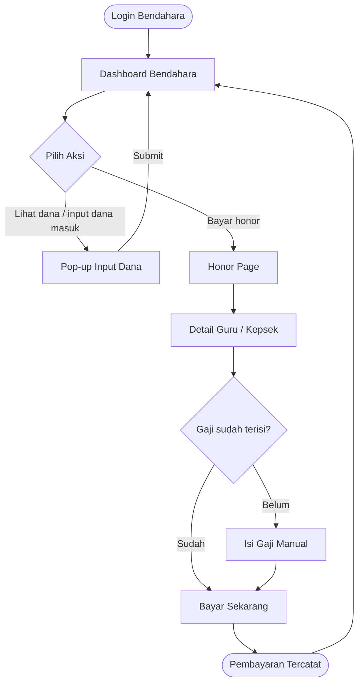
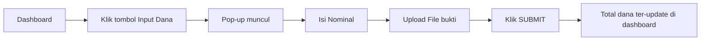
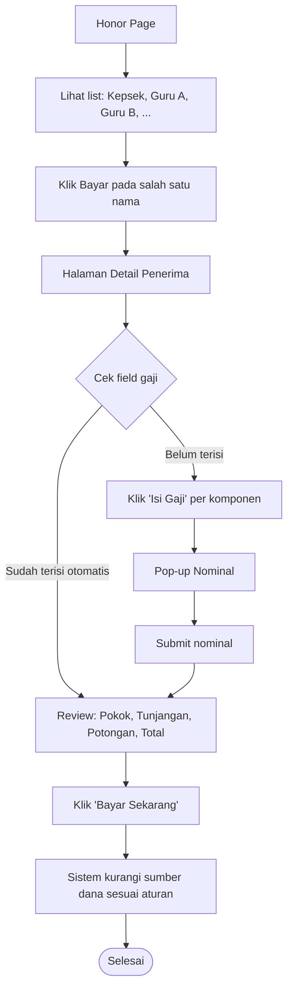
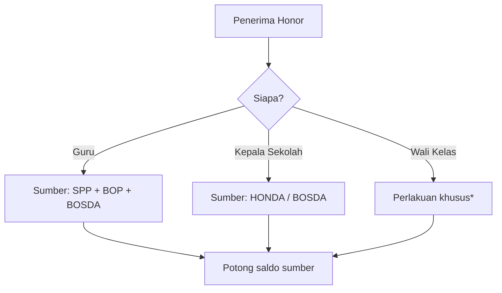
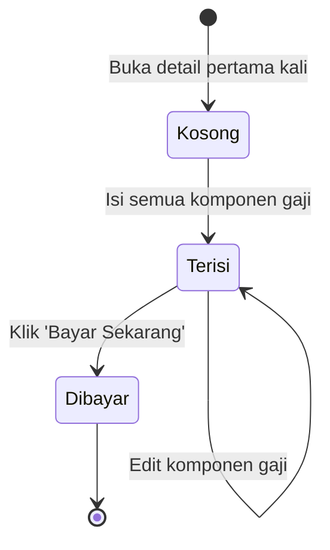

# User Flow — Sistem Bendahara Sekolah

> Dokumen ini menjelaskan **alur navigasi** dan **logic bisnis** dari sisi bendahara.
> Untuk detail tampilan UI per halaman, lihat dokumen `wireframe-spec-bendahara.md`.

---

## 1. Aktor

| Aktor | Peran |
|---|---|
| **Bendahara** | Mengelola dana masuk, melakukan pembayaran honor ke guru & kepala sekolah |

---

## 2. Alur Utama (High-Level)

---

## 3. Alur Detail per Fitur

### 3.1 Input Dana Masuk

**Catatan:**
- Sumber dana dicatat berdasarkan kategori (SPP, BOP, BOSDA, HONDA)
- File bukti wajib (kuitansi/transfer)

---

### 3.2 Pembayaran Honor

---

## 4. Logic Bisnis — Sumber Dana

Aturan sumber dana untuk pembayaran honor:

> **\*Wali Kelas:** dari sketsa, ada catatan khusus untuk wali kelas tapi detail belum jelas.
> **TODO:** klarifikasi apakah wali kelas dapat tambahan dari sumber lain atau ada tunjangan terpisah.

---

## 5. Komponen Gaji

| Komponen | Sifat | Contoh |
|---|---|---|
| Gaji Pokok | Tambah (+) | Rp 100.000 |
| Tunjangan | Tambah (+) | Rp 40.000 |
| Potongan | Kurang (−) | Rp 20.000 |
| **Total** | Hasil akhir | **Rp 120.000** |

Rumus: `Total = Gaji Pokok + Tunjangan − Potongan`

---

## 6. State Halaman Detail

---

## 7. Open Questions / TODO

- [ ] Detail perlakuan khusus untuk wali kelas (sumber dana tambahan? tunjangan ekstra?)
- [ ] Apakah field gaji bisa di-edit ulang setelah pembayaran?
- [ ] Validasi: bagaimana jika saldo sumber dana tidak mencukupi?
- [ ] Apakah ada riwayat / history pembayaran?
- [ ] Role selain bendahara (guru/kepsek apakah punya halaman sendiri?)
